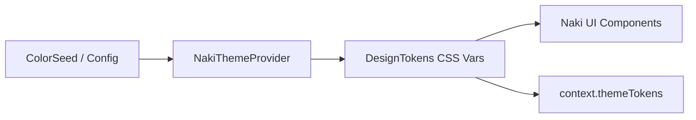

Naki UI provides a unified, token-based design system exported from `package:naki_ui/theme.dart`.

---

## Key Features

- 🎨 **Dynamic Color Seeds**: Generate consistent Material-inspired palettes from single brand hex colors.
- 🌓 **Mode Support**: First-class `light`, `dark`, and `system` theme modes with automatic local storage caching.
- 🪙 **CSS Variable Bridge**: All tokens are compiled to native CSS custom properties (e.g. `--naki-color-primary`, `--naki-spacing-md`).
- ⚡ **Zero FOUC**: Injects server-rendered `<style id="tokens">` tags for smooth static and SSR page loads.

---

## Theme Architecture

---

## Explore Theming Topics

<CardGroup cols={2}>
  <Card title="Color Seeds & Modes" icon="palette" href="/theming/color-seeds">
    ColorSeed, palette generation, and light/dark theme modes.
  </Card>
  <Card title="Theme Configuration" icon="gear" href="/theming/configuration">
    Configure `LightThemeData`, `DarkThemeData`, and `ThemeConfig`.
  </Card>
  <Card title="Design Tokens" icon="coins" href="/theming/tokens">
    Typography scales, spacing scales, radius, and shadows.
  </Card>
  <Card title="Styling Models" icon="ruler-combined" href="/theming/styling-models">
    `BoxDecoration`, `BorderRadius`, `EdgeInsets`, `Filter`, `Gradient`, `Shadow` and `TextStyle`.
  </Card>
</CardGroup>
